# New game pitch concepts (19 September 2026)

Desktop-only ui-mockup concepts for the six pitched games: Orin and Lumo (co-op), Kiri and Vela (teams on one call), Tolu and Miro (imposter). One landscape 1536x1024 screen per game, two fresh variants (-a, -b) each, generated in parallel from identical prompt text with no reference images. Any text in the images other than the title and CONFIRM is illustrative only.

## What was chosen

Three of the six are built and playable. See the 21 September section of
[docs/DESIGN.md](../../DESIGN.md).

| Game             | Direction built       | Note                                                                                                                                                                                                                                                          |
| ---------------- | --------------------- | ------------------------------------------------------------------------------------------------------------------------------------------------------------------------------------------------------------------------------------------------------------- |
| Orin             | `orin-landscape-v1-a` | Enamelled tin, cobalt and cream, one warm lamp per lit lighthouse. Built as CSS and SVG.                                                                                                                                                                      |
| Vela             | `vela-landscape-v1-a` | Dyed silk and split bamboo, ink-brush wind, generous white air. Built as CSS and SVG.                                                                                                                                                                         |
| Miro             | **neither**           | Both variants came back as dim painted fresco, too close to the register the rest of the library already occupies. Rebuilt in leaded and stained glass: flat saturated cells in dark came, lit from behind, so light is the mechanic as well as the material. |
| Lumo, Kiri, Tolu | not built             | Still concepts.                                                                                                                                                                                                                                               |

They are drawn in CSS and SVG rather than from generated plates, because their
boards are geometric and fully interactive — seven lighthouse stations,
twenty-four ribbon segments, five barge compartments — and a raster plate would
have to be overlaid with the same shapes anyway. Box and board artwork is still
open.

**On the IDs.** A first build of these three on 20 September was replaced twice
over and removed, and their stable IDs `orin`, `vela` and `miro` now belong to
the party games Top Tier, Outfox the Fox and Atlas. The worlds were therefore
rebuilt on their own IDs — `coast`, `meadow` and `canal` — and their own save
key. The public names are still Orin, Vela and Miro.

## Concept art

All images 1536x1024 PNG, generated 19 September 2026 with Codex built-in image generation, fresh from the prompt text below, no reference images.

### Orin (co-op, lighthouse coast)

`orin-landscape-v1-a.png`

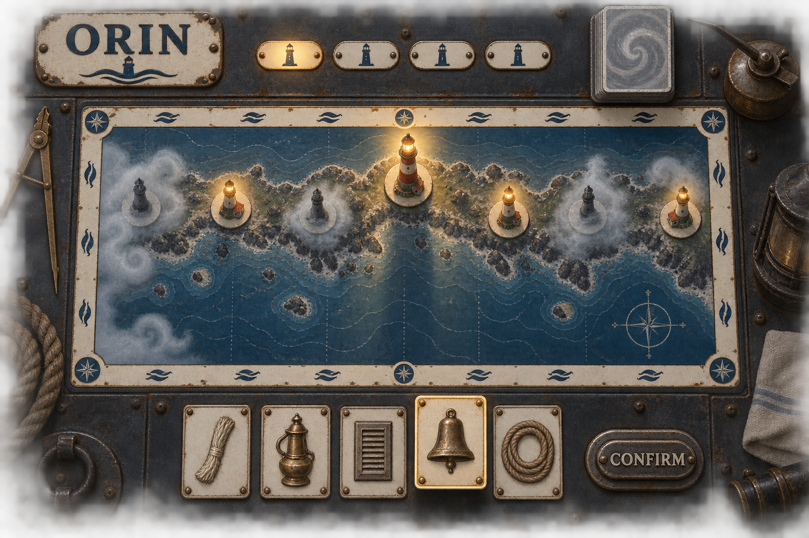

`orin-landscape-v1-b.png`

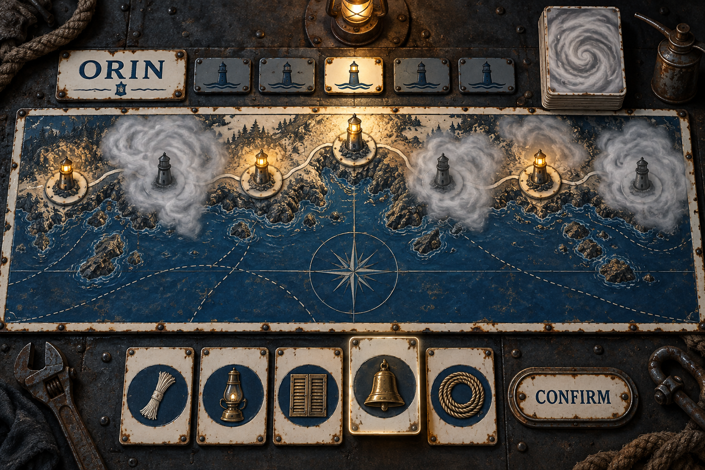

### Lumo (co-op, firefly lanterns)

`lumo-landscape-v1-a.png`

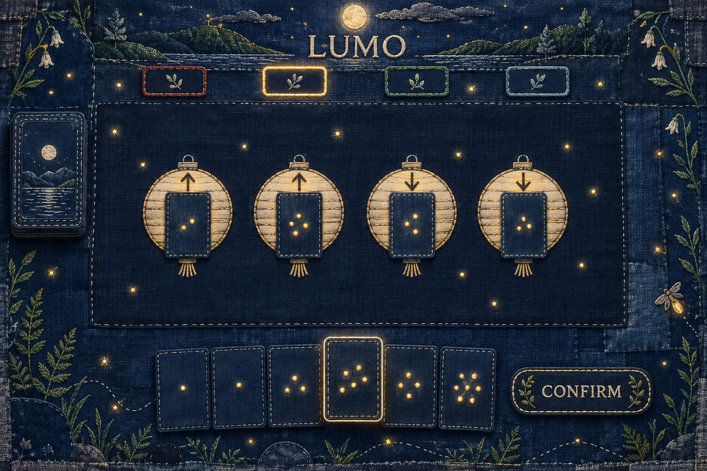

`lumo-landscape-v1-b.png`

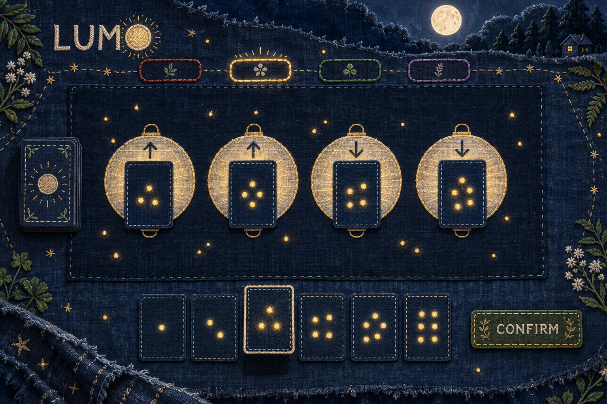

### Kiri (teams, picture market)

`kiri-landscape-v1-a.png`

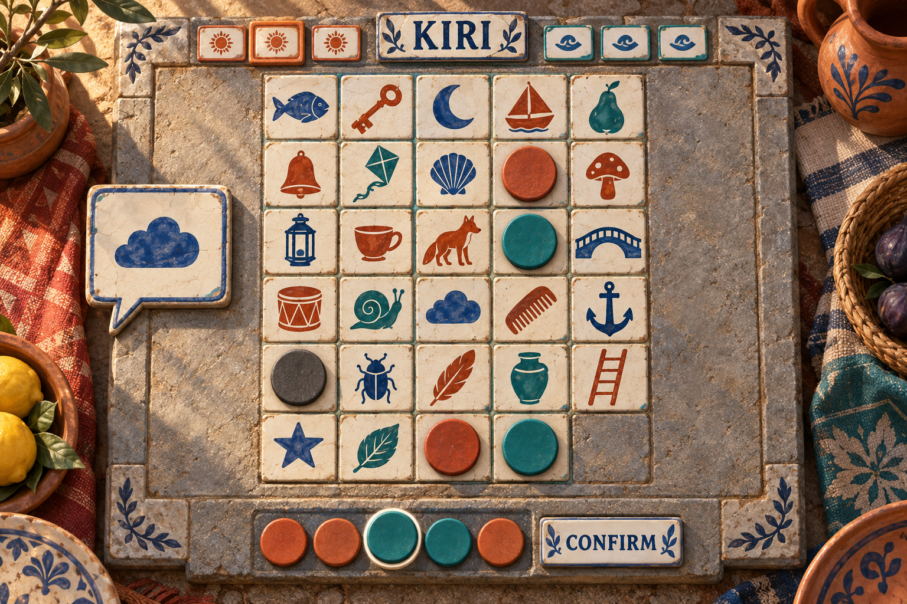

`kiri-landscape-v1-b.png`

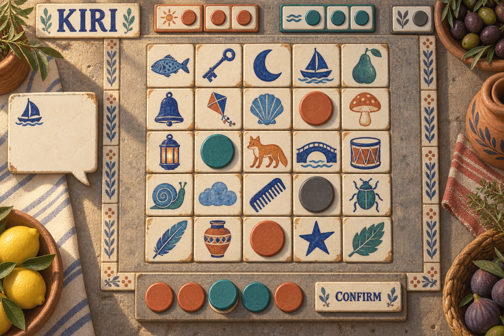

### Vela (teams, kite race)

`vela-landscape-v1-a.png`

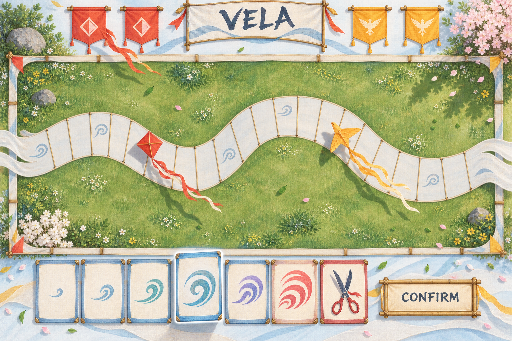

`vela-landscape-v1-b.png`

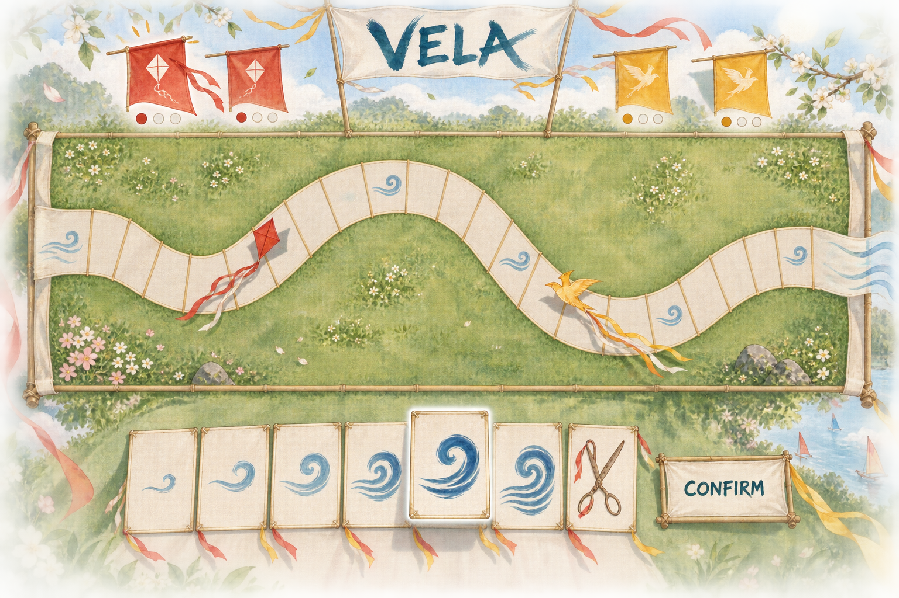

### Tolu (imposter, drum circle)

`tolu-landscape-v1-a.png`

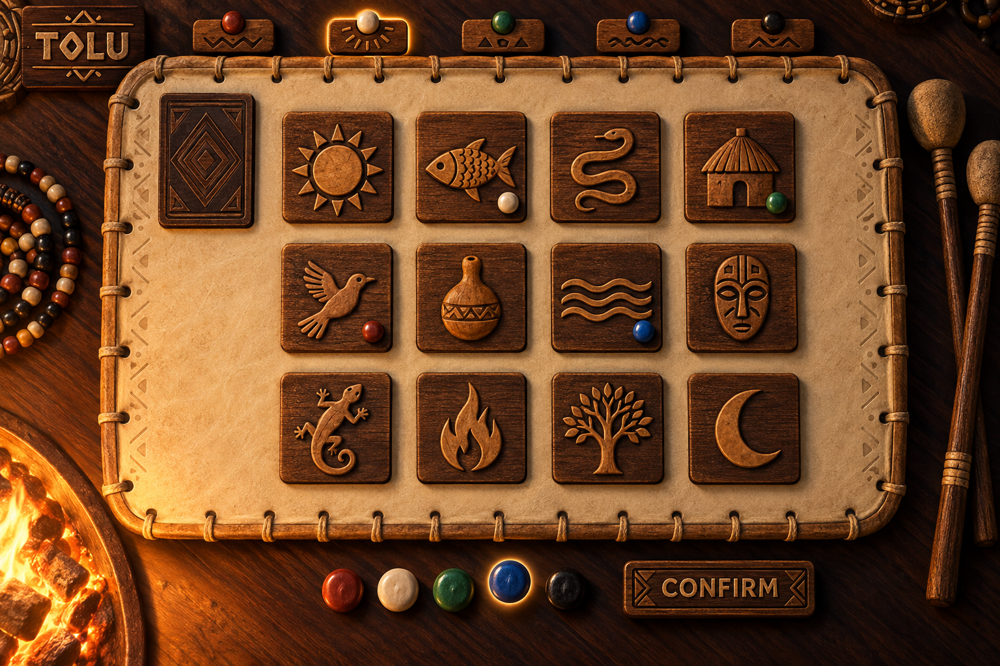

`tolu-landscape-v1-b.png`

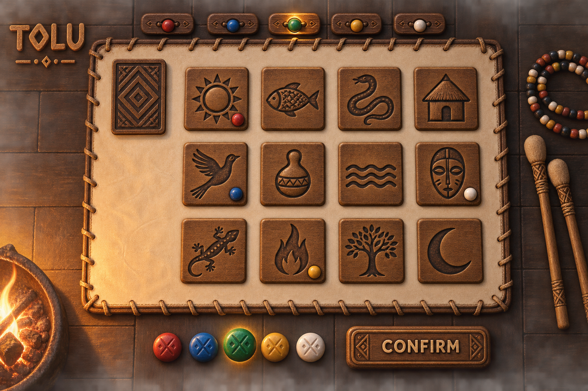

### Miro (imposter, canal run)

`miro-landscape-v1-a.png`

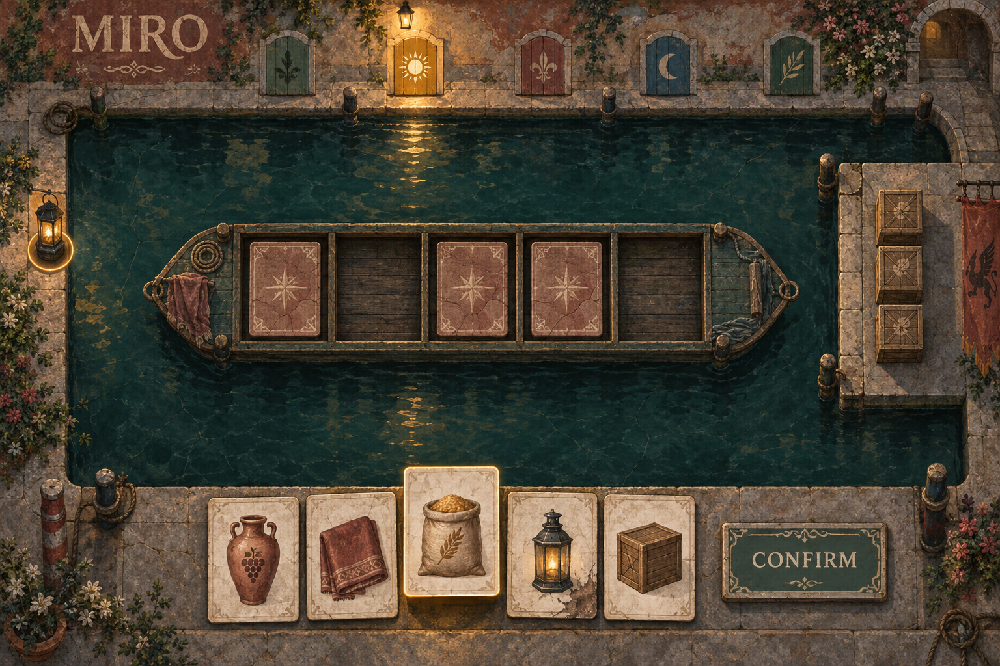

`miro-landscape-v1-b.png`

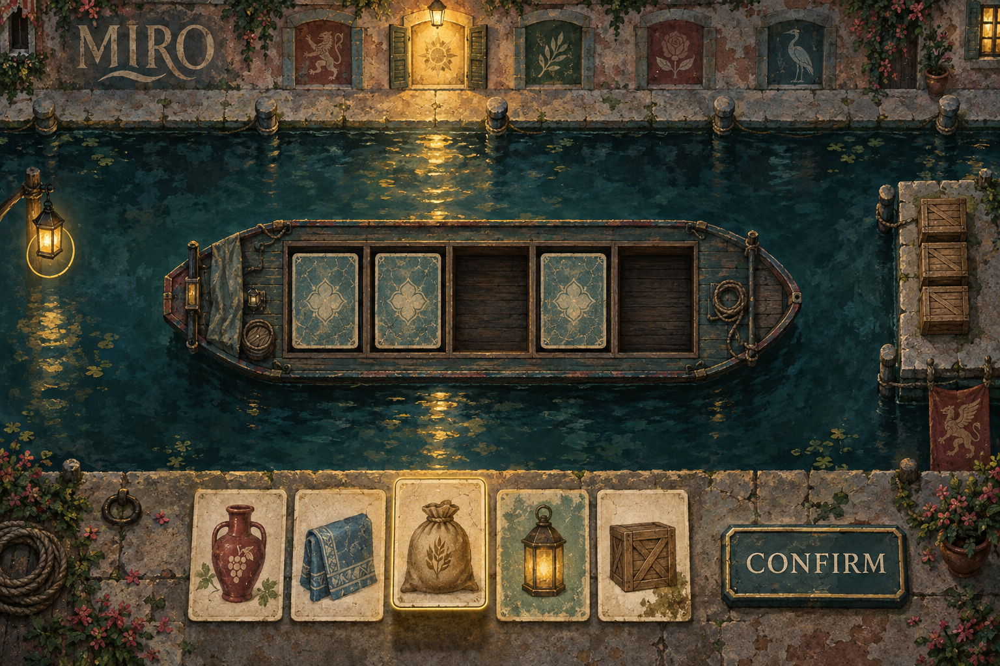

## Exact prompts

### Orin

```
Use case: ui-mockup. One landscape 1536x1024 complete playable screen of a digital cooperative board game titled ORIN. Style: pressed and enamelled tin signage, like an old lighthouse-service plaque: cream enamel with chipped edges, cobalt blue and fog grey fields, embossed raised outlines, small rust blooms at the rivets, cold sea-fog haze softening the far edges, one warm amber lamp glow per lit lighthouse. Quiet, dignified, maritime civil-service mood, slightly melancholy. Must not resemble the other Gamehub games: not cut paper or kraft cardstock paper-craft, not linocut, risograph or woodcut ink printmaking, not glossy soft-3D vinyl toy rendering. Not photoreal, not clay stop-motion. Not stitched textile, not glazed ceramic, not carved wood. Layout: the play surface is a flat enamelled coast chart filling the central 70 percent of the width and 55 percent of the height, seen exactly from above: a rocky shoreline runs left to right with exactly seven small lighthouses spaced along it, each standing on its own round enamel disc; four are lit with a warm amber pool, three are dark and half swallowed by a fog bank drawn as pale swirling enamel. Above the chart, a stack of face-down fog cards with a grey swirl back sits on the rim. Below the chart, the hand: five tool cards showing a wick, a brass lamp, a shutter, a bell and a rope, drawn as embossed tin pictograms, one lifted. CONFIRM is an embossed tin button beside the hand. Player tags on the top rim are small enamel name plates on rivets, one lit. Outside the chart the screen is dark riveted tin with a few tools and a tin oil can at the edges. The play surface is a flat rectangular area, wider than tall, drawn in true plan view exactly from above: no perspective convergence, no receding lines, no tilt inside it. The surroundings may show shallow depth at the edges only. Around the play surface runs a continuous calm rim band on which small player tags could sit at any position. No chairs, stools, seats, place settings or people anywhere. The player hand is a tightly packed row of flat cards at the bottom edge, one card lifted as the chosen pick, with CONFIRM as a pressable piece directly beside the hand. Player tags and status sit along the top edge, one clearly active. One light source only, named below; all shadows follow it. No device frame, no browser chrome, no status bar, no rules text, no numerals, no letters other than the title and CONFIRM, no logos. Light: the single lamp of the largest lit lighthouse near the top edge; light falls toward the viewer. Only the words ORIN and CONFIRM may appear.
```

### Lumo

```
Use case: ui-mockup. One landscape 1536x1024 complete playable screen of a digital cooperative card game titled LUMO. Style: indigo-dyed cotton cloth with visible weave and hand-stitched running-stitch embroidery in white and pale gold thread, small knotted gold thread dots as fireflies, faded patches, soft frayed hems, the whole screen reads as a folded summer-night blanket laid flat. Palette: deep indigo, midnight blue, off-white thread, warm gold thread, a touch of moss green. Calm, warm, sleepy summer night. Must not resemble the other Gamehub games: not cut paper or kraft cardstock paper-craft, not linocut, risograph or woodcut ink printmaking, not glossy soft-3D vinyl toy rendering. Not photoreal, not clay stop-motion. Not enamelled tin, not glazed ceramic, not carved wood, not silk. Layout: the play surface is a flat rectangular patch of darker indigo cloth filling the central 62 percent of the width and 50 percent of the height, seen exactly from above, with exactly four round embroidered lantern patches in a row across it; the two left lanterns have an upward stitched arrow, the two right lanterns a downward stitched arrow; each lantern has one flat cloth card resting on it showing a cluster of stitched firefly dots, no numerals. Fireflies as tiny gold knots drift across the dark cloth around the lanterns. Below, the hand: six flat cloth number cards showing firefly dot clusters of different sizes instead of numerals, one lifted. CONFIRM is an embroidered cloth label beside the hand. A small stitched deck pile sits on the left rim. Player tags on the top rim are small stitched name tags with a coloured thread border, one glowing. The play surface is a flat rectangular area, wider than tall, drawn in true plan view exactly from above: no perspective convergence, no receding lines, no tilt inside it. The surroundings may show shallow depth at the edges only. Around the play surface runs a continuous calm rim band on which small player tags could sit at any position. No chairs, stools, seats, place settings or people anywhere. The player hand is a tightly packed row of flat cards at the bottom edge, one card lifted as the chosen pick, with CONFIRM as a pressable piece directly beside the hand. Player tags and status sit along the top edge, one clearly active. One light source only, named below; all shadows follow it. No device frame, no browser chrome, no status bar, no rules text, no numerals, no letters other than the title and CONFIRM, no logos. Light: a single soft moon glow from the top edge; light falls toward the viewer. Only the words LUMO and CONFIRM may appear.
```

### Kiri

```
Use case: ui-mockup. One landscape 1536x1024 complete playable screen of a digital team word game titled KIRI. Style: hand-painted glazed ceramic tiles on a worn stone market counter: each tile is a square of thick cream glaze with a single bold painted picture in cobalt, terracotta and teal, slight glaze pooling, crazing, chipped corners, grout lines between tiles, a few tiles cooler or warmer from the kiln. Sunlit late-afternoon market mood, warm and social. Must not resemble the other Gamehub games: not cut paper or kraft cardstock paper-craft, not linocut, risograph or woodcut ink printmaking, not glossy soft-3D vinyl toy rendering. Not photoreal, not clay stop-motion. Not enamelled tin, not stitched textile, not carved wood, not silk. Layout: the play surface is a flat grey stone counter filling the central 60 percent of the width and 75 percent of the height, seen exactly from above, holding an exactly five by five grid of glazed picture tiles, twenty-five tiles, each with one simple painted object: a fish, a key, a moon, a boat, a pear, a bell, a kite, a shell, a crow, a mushroom, a lantern, a cup, a fox, a bridge, a drum, a snail, a cloud, a comb, an anchor, a beetle, a feather, a jar, a ladder, a star, a leaf. Three tiles are already claimed and covered by a flat round terracotta disc, two by a flat round teal disc; one tile is covered by a dark grey disc. To the left of the counter, the current team clue is shown as an empty painted speech tile with a single small pictogram, no letters. Below, instead of a card hand, a short row of five flat team tokens: terracotta discs and teal discs, one lifted, with CONFIRM as a glazed tile button beside them. Player tags on the top rim are small glazed name tiles grouped into a terracotta group and a teal group, one active. Around the counter, market cloth, a few clay pots and a basket at the edges. The play surface is a flat rectangular area, wider than tall, drawn in true plan view exactly from above: no perspective convergence, no receding lines, no tilt inside it. The surroundings may show shallow depth at the edges only. Around the play surface runs a continuous calm rim band on which small player tags could sit at any position. No chairs, stools, seats, place settings or people anywhere. The player hand is a tightly packed row of flat cards at the bottom edge, one card lifted as the chosen pick, with CONFIRM as a pressable piece directly beside the hand. Player tags and status sit along the top edge, one clearly active. One light source only, named below; all shadows follow it. No device frame, no browser chrome, no status bar, no rules text, no numerals, no letters other than the title and CONFIRM, no logos. Light: single warm afternoon sun from the top-left; light falls toward the viewer. Only the words KIRI and CONFIRM may appear.
```

### Vela

```
Use case: ui-mockup. One landscape 1536x1024 complete playable screen of a digital team racing card game titled VELA. Style: dyed silk and split bamboo, like kite-making: translucent washes of colour on thin silk with visible fibre, bamboo spars as thin warm lines, long streaming paper tails, loose watercolour sky and grass washes, ink-brush wind lines, generous white air. Palette: sky white, pale cerulean, saffron, vermilion, grass green, bamboo tan. Breezy, open, festive spring mood. Must not resemble the other Gamehub games: not cut paper or kraft cardstock paper-craft, not linocut, risograph or woodcut ink printmaking, not glossy soft-3D vinyl toy rendering. Not photoreal, not clay stop-motion. Not enamelled tin, not stitched textile, not glazed ceramic, not carved wood. Layout: the play surface is a flat rectangular meadow seen exactly from above, filling the central 72 percent of the width and 52 percent of the height, with a wind track painted as a wide ribbon of pale silk that snakes from the left edge to the right edge in three gentle bends, divided into about twenty-four segments by thin bamboo cross-lines; a few segments carry a small painted gust swirl. Two flat kites, one vermilion diamond and one saffron bird shape, each with a long trailing tail, sit on different segments of the track as the team pieces, drawn flat with a soft offset shadow. Below the meadow, the hand: six flat silk wind cards each painted with a brush swirl of a different size instead of numerals, plus one distinct card with a pair of painted scissors, one card lifted. CONFIRM is a bamboo and silk tag beside the hand. Player tags on the top rim are small silk pennants in two team colours, vermilion and saffron, one fluttering as active. The play surface is a flat rectangular area, wider than tall, drawn in true plan view exactly from above: no perspective convergence, no receding lines, no tilt inside it. The surroundings may show shallow depth at the edges only. Around the play surface runs a continuous calm rim band on which small player tags could sit at any position. No chairs, stools, seats, place settings or people anywhere. The player hand is a tightly packed row of flat cards at the bottom edge, one card lifted as the chosen pick, with CONFIRM as a pressable piece directly beside the hand. Player tags and status sit along the top edge, one clearly active. One light source only, named below; all shadows follow it. No device frame, no browser chrome, no status bar, no rules text, no numerals, no letters other than the title and CONFIRM, no logos. Light: a single high spring sun from the top-right; light falls toward the viewer. Only the words VELA and CONFIRM may appear.
```

### Tolu

```
Use case: ui-mockup. One landscape 1536x1024 complete playable screen of a digital hidden-imposter party game titled TOLU. Style: carved dark hardwood, tooled leather and strung beads: relief-carved wooden tiles with burnished edges, warm oiled grain, a large flat stretched drumhead of pale tooled leather with a laced rim, clay and glass beads in ochre, rust, bone white and black. Firelit evening gathering mood, warm and rhythmic, intimate but never spooky. Must not resemble the other Gamehub games: not cut paper or kraft cardstock paper-craft, not linocut, risograph or woodcut ink printmaking, not glossy soft-3D vinyl toy rendering. Not photoreal, not clay stop-motion. Not enamelled tin, not stitched textile, not glazed ceramic, not silk. Layout: the play surface is a flat rectangular drumhead of pale tooled leather seen exactly from above, filling the central 66 percent of the width and 62 percent of the height, its laced leather rim forming the calm band around it. On the leather lie exactly twelve relief-carved wooden picture tiles in a four by three grid, each with one bold carved object: a sun, a fish, a snake, a hut, a bird, a gourd, a river, a mask, a lizard, a flame, a tree, a moon. Four tiles already carry a small bead on them as hints placed by earlier players. In the top-left corner of the leather, one face-down secret card with a carved lid pattern. Below, instead of a card hand, a short row of five flat clay vote beads in different player colours, one lifted, with CONFIRM as a carved wooden button beside them. Player tags on the top rim are small carved wooden name pegs with a bead, one active. Around the drum, dark wood floor, a coil of beads, a pair of drum sticks at the edge. The play surface is a flat rectangular area, wider than tall, drawn in true plan view exactly from above: no perspective convergence, no receding lines, no tilt inside it. The surroundings may show shallow depth at the edges only. Around the play surface runs a continuous calm rim band on which small player tags could sit at any position. No chairs, stools, seats, place settings or people anywhere. The player hand is a tightly packed row of flat cards at the bottom edge, one card lifted as the chosen pick, with CONFIRM as a pressable piece directly beside the hand. Player tags and status sit along the top edge, one clearly active. One light source only, named below; all shadows follow it. No device frame, no browser chrome, no status bar, no rules text, no numerals, no letters other than the title and CONFIRM, no logos. Light: a single warm fire glow from the bottom-left edge; light falls up and across the drumhead. Only the words TOLU and CONFIRM may appear.
```

### Miro

```
Use case: ui-mockup. One landscape 1536x1024 complete playable screen of a digital hidden-traitor card game titled MIRO. Style: aged gouache on stained lime plaster, like a faded canal-city fresco: matte chalky pigment, hairline cracks, water stains, terracotta, verdigris green, ochre, dusty rose and a deep lagoon teal, soft lamplight from windows reflected in dark water, brushy but confident shapes. Damp misty evening mood, secretive and elegant. Must not resemble the other Gamehub games: not cut paper or kraft cardstock paper-craft, not linocut, risograph or woodcut ink printmaking, not glossy soft-3D vinyl toy rendering. Not photoreal, not clay stop-motion. Not enamelled tin, not stitched textile, not glazed ceramic, not carved wood, not silk. Layout: the play surface is a flat rectangular stretch of dark canal water seen exactly from above, filling the central 68 percent of the width and 56 percent of the height, bordered on both long sides by narrow stone quays with mooring posts that form the calm rim band; on the water, centred, one flat open cargo barge drawn in plan view whose open hold is divided into five square compartments; three compartments hold a face-down cargo card with a plaster-crack back, two are empty. At the right end of the water, a small stone dock with a stack of three crates showing the delivery demand as crate count, no numerals. On the left rim, a small pilot lantern token marks the current pilot. Below, the hand: five flat cargo cards painted with goods, a wine jar, a bolt of cloth, a sack of grain, a lantern and a crate, one lifted; one card in the hand has a faint rot stain on it. CONFIRM is a painted plaster button beside the hand. Player tags on the top rim are small painted shutters on the quay wall, one lit. The play surface is a flat rectangular area, wider than tall, drawn in true plan view exactly from above: no perspective convergence, no receding lines, no tilt inside it. The surroundings may show shallow depth at the edges only. Around the play surface runs a continuous calm rim band on which small player tags could sit at any position. No chairs, stools, seats, place settings or people anywhere. The player hand is a tightly packed row of flat cards at the bottom edge, one card lifted as the chosen pick, with CONFIRM as a pressable piece directly beside the hand. Player tags and status sit along the top edge, one clearly active. One light source only, named below; all shadows follow it. No device frame, no browser chrome, no status bar, no rules text, no numerals, no letters other than the title and CONFIRM, no logos. Light: a single warm window lamp on the top rim; light falls toward the viewer across the water. Only the words MIRO and CONFIRM may appear.
```
