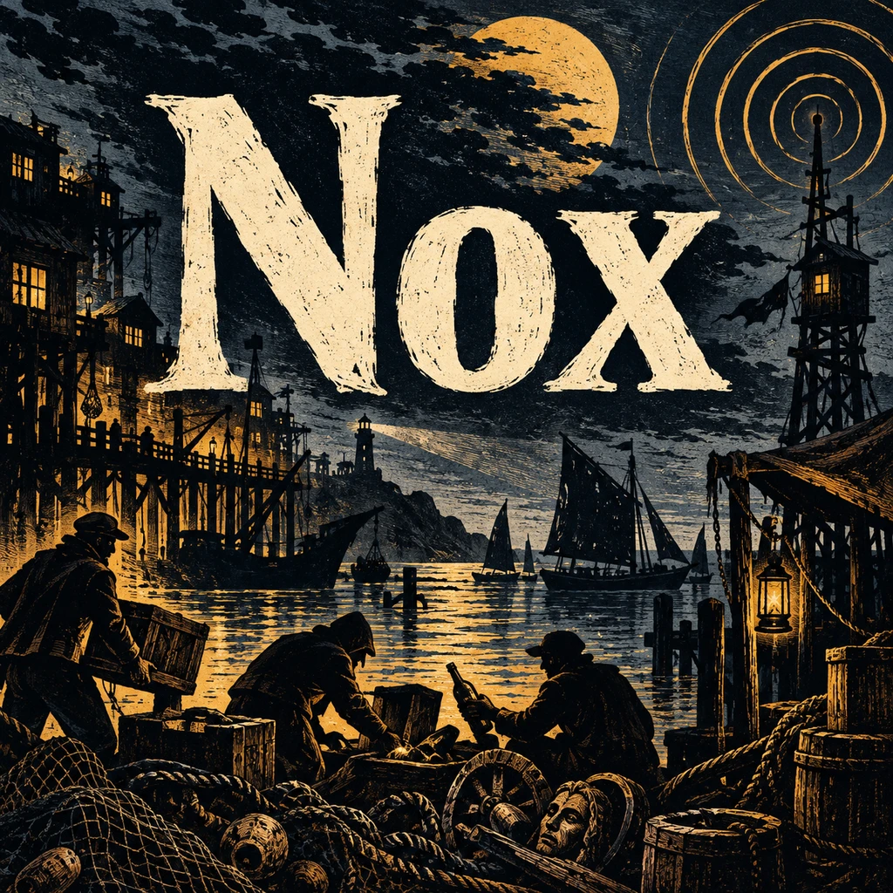
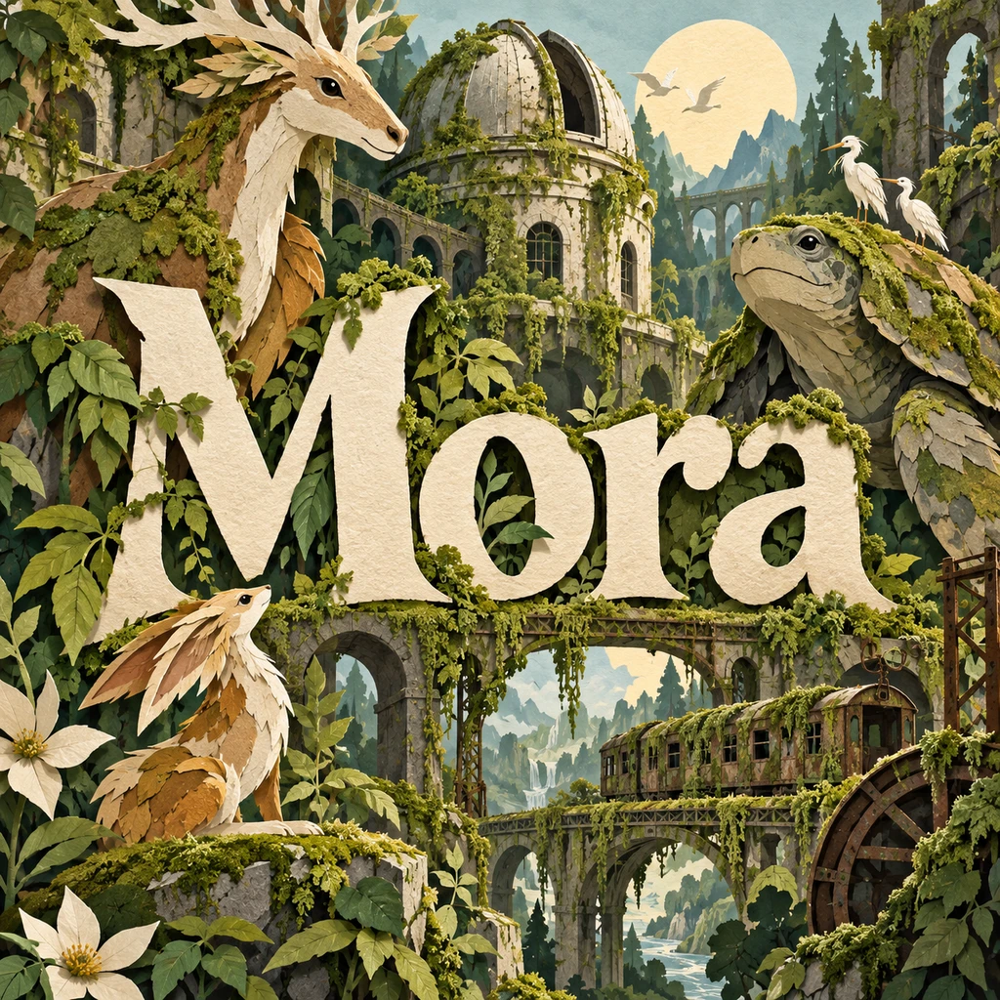
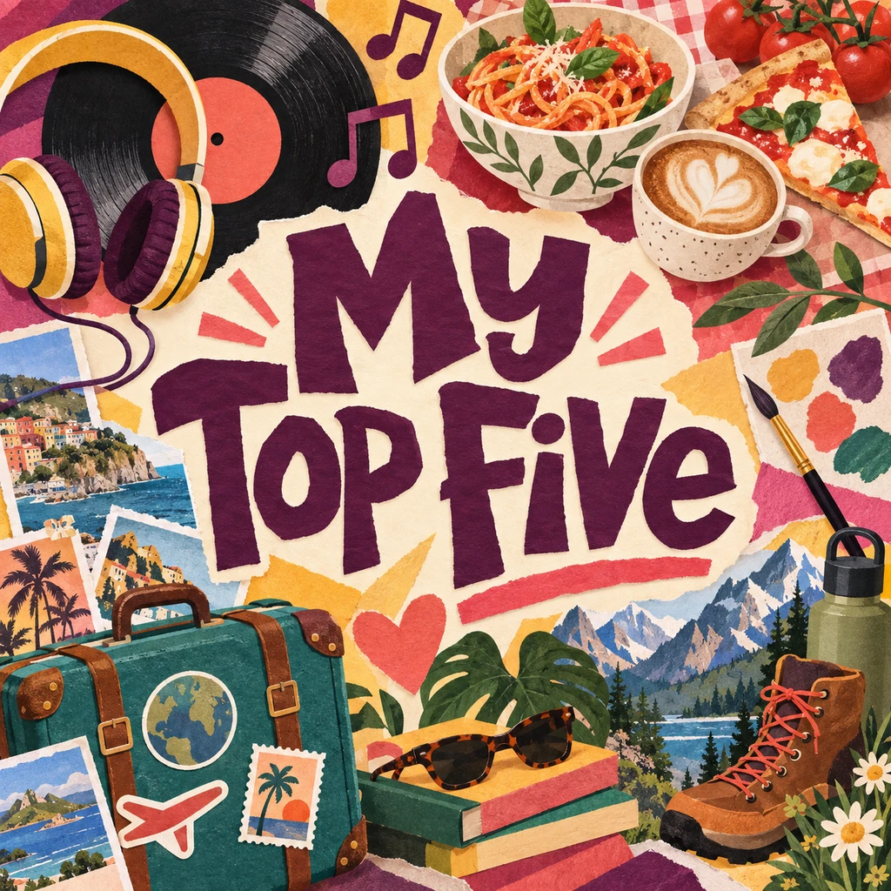
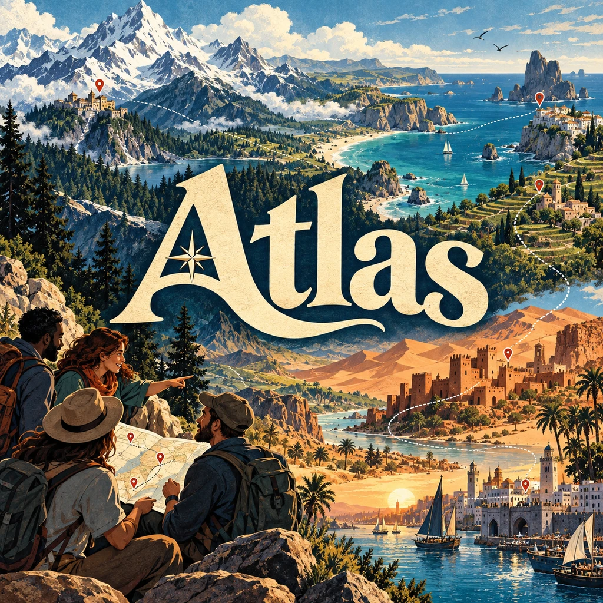

# Fresh square library covers — 21 September 2026

All five playable game covers were generated from written briefs without old
artwork references. Every title is part of its generated image. Public party
names are My Top Five, Find the Lie and Atlas; stable internal IDs are unchanged.

Each accepted cover is a full-bleed 1024-square WebP with a preserved native PNG.
Responsive 320/640 variants and narrow edge-texture spines are mechanical delivery
derivatives made by `node --experimental-strip-types scripts/optimize-box-covers.mjs`.
`lib/games/box-covers.ts` supplies both library and online selection artwork.

The library shows these covers without overlaid titles or contrast gradients;
setup preserves the entire square and keeps an accessible dialog heading.

## Nox

[Prompt and provenance](2026-09-21-blind-nox.md).

## Mora

[Prompt and provenance](2026-09-21-blind-mora.md).

## Yata

[Prompt and provenance](2026-09-21-blind-yata.md).

## My Top Five

[Prompt and provenance](2026-09-21-blind-my-top-five.md).

## Atlas

[Prompt and provenance](2026-09-21-blind-atlas.md).

## Review boundaries

Original outputs and square/thumbnail compositions visually reviewed. Yata v2
has a tiny decorative brush fleck outside the requested 8% title-safe inset;
its actual lettering remains clearly readable and complete. Earlier Yata and
superseded Top Tier attempts are preserved and not used in the app.
Typecheck, targeted lint, the production build, and all 15 selected party-game
tests passed. Browser/compositor and touch behavior have not been checked in
this task.
